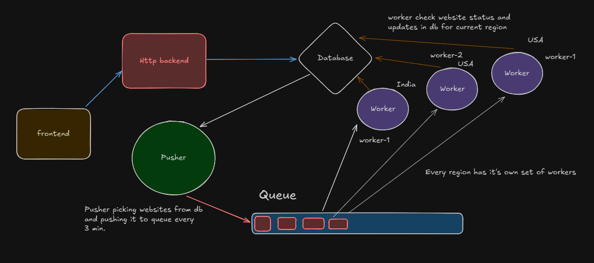
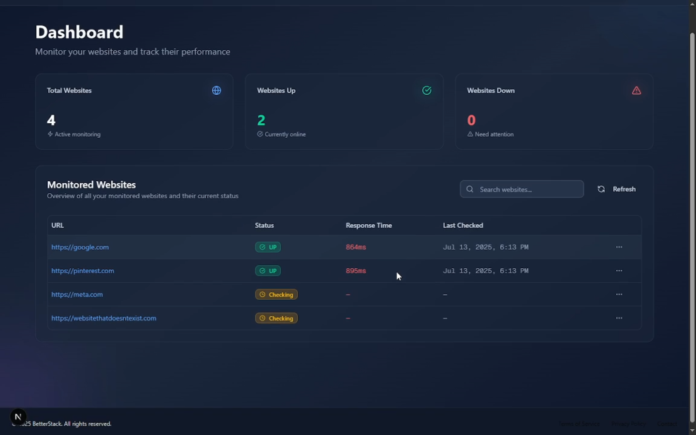
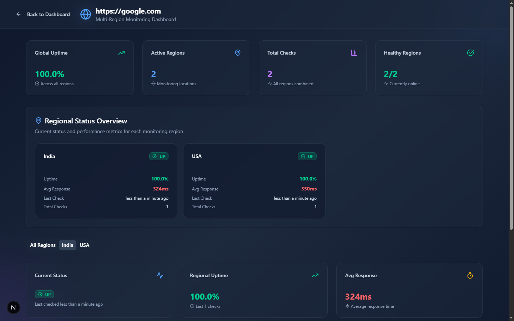

# 🧠 BetterStack — Website Uptime Monitoring Platform

BetterStack is a modern, full-stack **website uptime monitoring platform** designed with scalability and real-time observability in mind. It features:

- 🔄 Real-time backend using **Redis Streams**
- 🌍 Distributed, region-based monitoring with **auto-scaling workers**
- 🖥️ A sleek dashboard built with **Next.js + Tailwind CSS**
- ⚙️ Background workers that track uptime and response times
- 📡 Periodic queueing of websites via a **pusher service**

All wrapped in a **modular monorepo** powered by **Turborepo**.

---

## 🧱 Architecture

> 📌 The system is built with clear separation of concerns:
> - **Frontend**: Dashboard and monitoring views
> - **Backend**: API layer for websites/regions
> - **Pusher**: Periodically adds websites to Redis queue
> - **Worker**: Distributed consumers processing uptime checks

---

## 🛠 Tech Stack

| Layer        | Tech                            |
|--------------|----------------------------------|
| Monorepo     | [Turborepo](https://turbo.build/repo) |
| Frontend     | [Next.js](https://nextjs.org/), [Tailwind CSS](https://tailwindcss.com/) |
| Backend      | [Express.js](https://expressjs.com/) |
| Queue        | [Redis Streams](https://redis.io/docs/latest/develop/data-types/streams/) |
| Database     | [PostgreSQL](https://www.postgresql.org/) via [Prisma ORM](https://www.prisma.io/) |
| Worker       | Node.js — for distributed region-based website checks |
| Pusher       | Node.js — queues websites every 3 minutes |

---

## 🌐 Live Demo

🔗 [Watch BetterStack in Action (YouTube)](https://youtu.be/JWTCZyGvBXk?si=iMx9BN-GK4S1mFKZ)

### 🖥 UI Screenshots

**Dashboard**

**Monitoring View**

---

## 📦 Features

- ✅ Add regions and websites dynamically
- 🔄 Automatically create consumer groups for new regions
- 🚀 Launch new workers per region using Redis `XGROUP`
- ⏱ Real-time monitoring with response time metrics
- 📊 Scalable architecture with separate services for pushing, processing, and viewing data

---